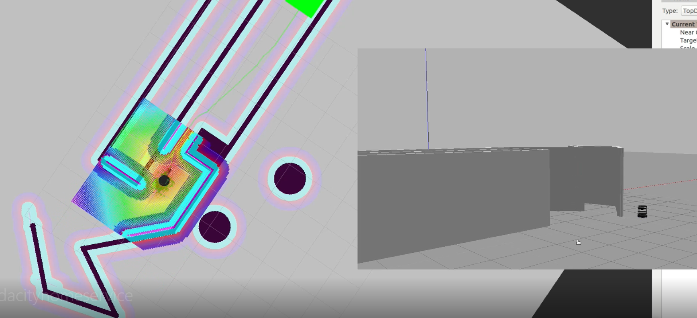
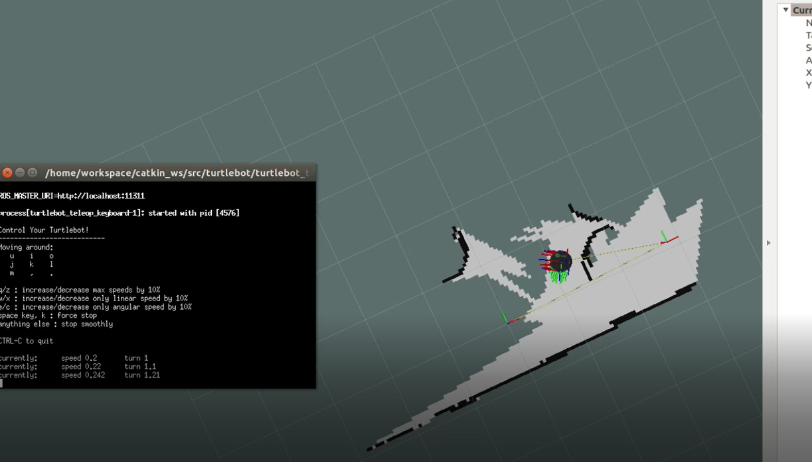
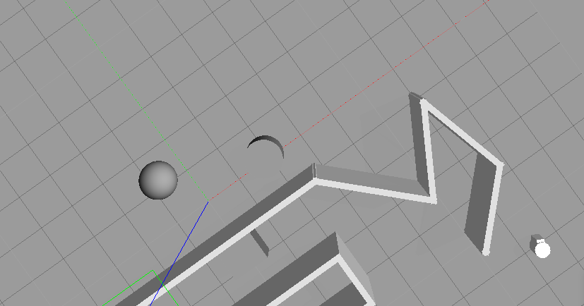
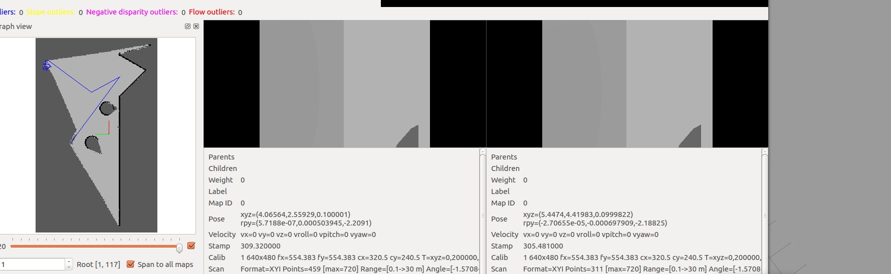
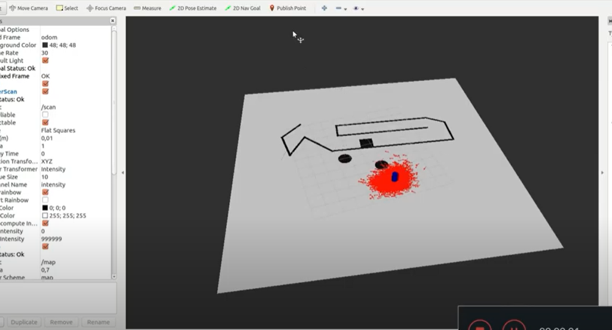
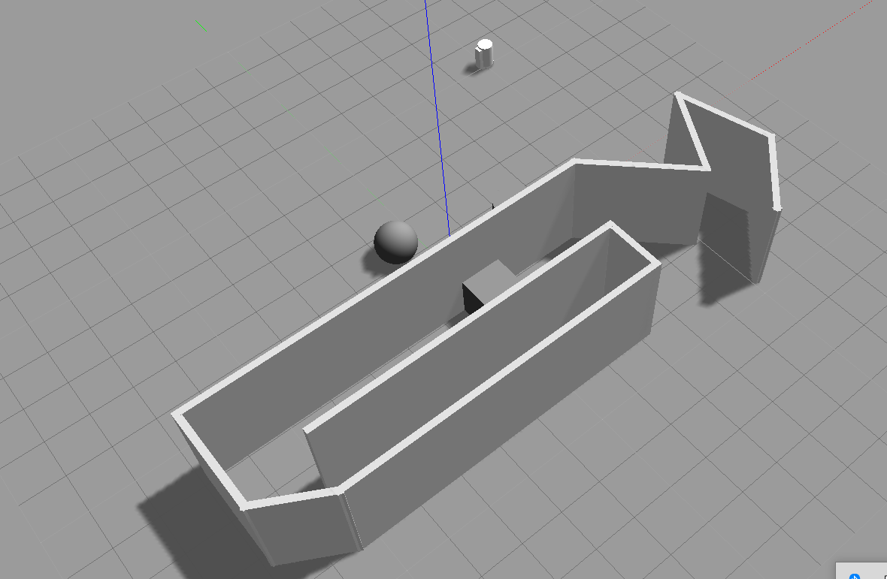
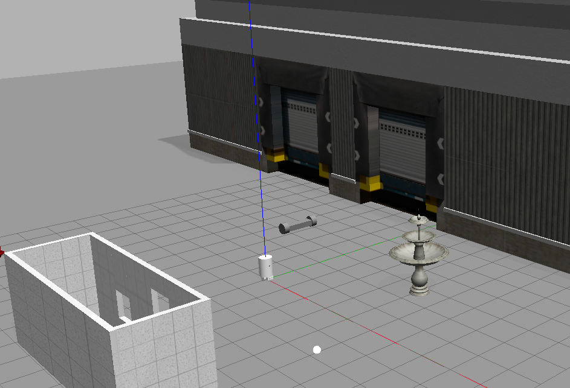
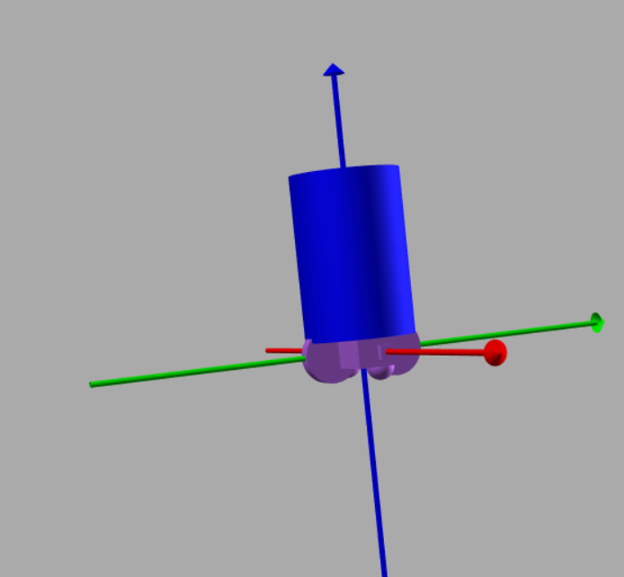

## **Gazebo ROS  Home Service, Map My World , Where AM I and Ball Chaser**



Link of video https://www.youtube.com/watch?v=H78B54bCRh4

Final project for Udacity's Robotics Software Engineer Nanodegree Program

**Project Goals**

- Design robot's environment with the Building Editor in Gazebo.
- Teleoperate the robot and manually test SLAM.
- Use the ROS navigation stack and manually command the robot using the 2D Nav Goal arrow in rviz to move to 2 different desired positions and orientations.
- Write a pick_objects node that commands the robot to move to the desired pickup and drop off zones.
- Write an add_markers node that subscribes to the robot odometry and publishes pick-up and drop-off markers to rviz.
- modify pick_objects node and add_markers node to establish communication between them, to complete desired home service robot implementation

### Prerequisites

- Ubuntu 16.04 OS with default make (>=4.1) and g++/gcc (>=5.4) packages
- Gazebo >= 7.0
- ROS Kinetic
- following ROS packages were used and the process of obtaining them is detailed below:
  - [gmapping](http://wiki.ros.org/gmapping)
  - [turtlebot_teleop](http://wiki.ros.org/turtlebot_teleop)
  - [turtlebot_rviz_launchers](http://wiki.ros.org/turtlebot_rviz_launchers)
  - [turtlebot_gazebo](http://wiki.ros.org/turtlebot_gazebo)


### Directory Tree and contents

```
    ├──                                # Official ROS packages
    |
    ├── slam_gmapping                  # gmapping_demo.launch file                   
    │   ├── gmapping
    │   ├── ...
    ├── turtlebot                      # keyboard_teleop.launch file
    │   ├── turtlebot_teleop
    │   ├── ...
    ├── turtlebot_interactions         # view_navigation.launch file      
    │   ├── turtlebot_rviz_launchers
    │   ├── ...
    ├── turtlebot_simulator            # turtlebot_world.launch file 
    │   ├── turtlebot_gazebo
    │   ├── ...
    ├──                                # Your packages and direcotries
    |
    ├── map                            # map files
    │   ├── ...
	├── world                          # world files
    │   ├── ...
    ├── scripts                        # shell scripts files
    │   ├── ...
    ├──rvizConfig                      # rviz configuration files
    │   ├── ...
    ├──pick_objects                    # pick_objects C++ node
    │   ├── src/pick_objects.cpp
    │   ├── ...
    ├──add_markers                     # add_marker C++ node
    │   ├── src/add_markers.cpp
    │   ├── ...
    └──
```


# File pick_objects.cpp

`#include <ros/ros.h>`
`#include <move_base_msgs/MoveBaseAction.h>`
`#include <actionlib/client/simple_action_client.h>`

`// Define a client for to send goal requests to the move_base server through a SimpleActionClient`
`typedef actionlib::SimpleActionClient<move_base_msgs::MoveBaseAction> MoveBaseClient;`

`int main(int argc, char** argv){`
  `// Initialize the simple_navigation_goals node`
  `ros::init(argc, argv, "simple_navigation_goals");`

  `//tell the action client that we want to spin a thread by default`
  `MoveBaseClient ac("move_base", true);`

  `// Wait 5 sec for move_base action server to come up`
  `while(!ac.waitForServer(ros::Duration(5.0))){`
    `ROS_INFO("Waiting for the move_base action server to come up");`
  `}`

  `move_base_msgs::MoveBaseGoal goal;`

  `// set up the frame parameters`
  `goal.target_pose.header.frame_id = "base_link";`
  `goal.target_pose.header.stamp = ros::Time::now();`

  `// Define a position and orientation for the robot to reach`
  `goal.target_pose.pose.position.x = -5.71;`
  `goal.target_pose.pose.position.y = -1.53;`
  `goal.target_pose.pose.orientation.w = 0.622392598035;`

   `// Send the goal position and orientation for the robot to reach`
  `ROS_INFO("Sending goal");`
  `ac.sendGoal(goal);`

  `// Wait an infinite time for the results`
  `ac.waitForResult();`

  `// Check if the robot reached its goal`
  `if(ac.getState() == actionlib::SimpleClientGoalState::SUCCEEDED){`
          `ROS_INFO("Hooray, the base finish first goal");`

	  ros::Duration(5).sleep();
	
	      move_base_msgs::MoveBaseGoal goal;
	
	  // set up the frame parameters
	  goal.target_pose.header.frame_id = "base_link";
	  goal.target_pose.header.stamp = ros::Time::now();
	
	  // Define a position and orientation for the robot to reach
	  goal.target_pose.pose.position.x = 1.75;
	  goal.target_pose.pose.position.y = 4.42;
	  goal.target_pose.pose.orientation.w = 0.622392598035;
	
	   // Send the goal position and orientation for the robot to reach
	  ROS_INFO("Sending second goal");
	  ac.sendGoal(goal);
	
	      // Wait an infinite time for the results
	  ac.waitForResult();
	
	  // Check if the robot reached its goal
	  if(ac.getState() == actionlib::SimpleClientGoalState::SUCCEEDED){

 	      `ROS_INFO("Hooray, the base finish second goal");`
	      `ros::Duration(5).sleep();`


	  }
	  else
			ROS_INFO("The base failed to move forward 1 meter for some reason");

  `}`
  `else`
    `ROS_INFO("The base failed to move forward 1 meter for some reason");`

  `return 0;`
`}`







Link of video https://www.youtube.com/watch?v=j5QfccN_Ai0




## Arquivo mapping.launch

`<?xml version="1.0" encoding="UTF-8"?>`

`<launch>`
  `<!-- Arguments for launch file with defaults provided -->`
  `<arg name="database_path"     default="rtabmap.db"/>`
  `<arg name="rgb_topic"   default="/camera/rgb/image_raw"/>`
  `<arg name="depth_topic" default="/camera/depth/image_raw"/>`
  `<arg name="camera_info_topic" default="/camera/rgb/camera_info"/>  
  <arg name="scan_topic" default="/scan" />`

  `<!-- Mapping Node -->`
 `<group ns="rtabmap">`
    `<node name="rtabmap" pkg="rtabmap_ros" type="rtabmap" output="screen" args="--delete_db_on_start">`

      <!-- Basic RTAB-Map Parameters -->
      <param name="database_path"       type="string" value="$(arg database_path)"/>
      <param name="frame_id"            type="string" value="robot_footprint"/>
      <param name="odom_frame_id"       type="string" value="odom"/> 	
      <param name="subscribe_depth"     type="bool"   value="true"/>
      <param name="subscribe_scan"      type="bool"   value="true"/>
    
      <!-- RTAB-Map Inputs -->
      <remap from="/rtabmap/scan" to="$(arg scan_topic)"/> 
      <remap from="/rtabmap/odom" to="/odom"/>-->


      <remap from="rgb/image" to="$(arg rgb_topic)"/>
      <remap from="depth/image" to="$(arg depth_topic)"/>
      <remap from="rgb/camera_info" to="$(arg camera_info_topic)"/>
    
      <!-- RTAB-Map Output -->
      <remap from="grid_map" to="/map"/>
    
      <!-- Rate (Hz) at which new nodes are added to map -->
      <param name="Rtabmap/DetectionRate" type="string" value="1"/>
    
      <!-- 2D SLAM -->
      <param name="Reg/Force3DoF" type="string" value="true"/>


      <!-- Loop Closure Detection -->
      <!-- 0=SURF 1=SIFT 2=ORB 3=FAST/FREAK 4=FAST/BRIEF 5=GFTT/FREAK 6=GFTT/BRIEF 7=BRISK 8=GFTT/ORB 9=KAZE -->
      <param name="Kp/DetectorStrategy" type="string" value="0"/>
    
      <!-- Maximum visual words per image (bag-of-words) -->
      <param name="Kp/MaxFeatures" type="string" value="400"/>
    
      <!-- Used to extract more or less SURF features -->
      <param name="SURF/HessianThreshold" type="string" value="100"/>
    
      <!-- Loop Closure Constraint -->
      <!-- 0=Visual, 1=ICP (1 requires scan)-->
      <param name="Reg/Strategy" type="string" value="0"/>
    
      <!-- Minimum visual inliers to accept loop closure -->
      <param name="Vis/MinInliers" type="string" value="15"/>
    
      <!-- Set to false to avoid saving data when robot is not moving -->
      <param name="Mem/NotLinkedNodesKept" type="string" value="false"/>
    </node>

`` 

    <!-- publishing static tf between camera base and RGBD camera link -->
    <!--<node pkg="tf" type="static_transform_publisher" name="cam_tf_broadcaster" args="0 0 0 -1.570 0 -1.570  camera camera_link_optical 10" />-->


    <!-- Move Base >
    <node name="move_base" pkg="move_base" type="move_base" respawn="false" output="screen">
      <remap from="scan" to="/scan" />
      <param name="base_global_planner" value="navfn/NavfnROS"/>
      <param name="base_local_planner" value="base_local_planner/TrajectoryPlannerROS"/>
      <rosparam file="$(find my_robot)/config/costmap_common_params.yaml" command="load" ns="global_costmap" />
      <rosparam file="$(find my_robot)/config/costmap_common_params.yaml" command="load" ns="local_costmap" />
      <rosparam file="$(find my_robot)/config/local_costmap_params.yaml" command="load" />
      <rosparam file="$(find my_robot)/config/global_costmap_params.yaml" command="load" />
      <rosparam file="$(find my_robot)/config/base_local_planner_params.yaml" command="load" />
    </node-->

 `</group>`

`</launch>`

Link of vídeo https://www.youtube.com/watch?v=eQeoTbMQ3ME




The world map nauber5.world is used in this task 





## File  AMCL.launch

`<launch>`
`<!-- TODO: Add nodes here -->`
`<arg name="map_file" default="/home/workspace/catkin_ws/src/my_robot/maps/nauber5.yaml"/>`
`<node name="map_server" pkg="map_server" type="map_server" args="$(arg map_file)" />`


`<node name="amcl" pkg="amcl" type="amcl" output="screen">`

  `<param name="odom_frame_id" value="odom"/>`
  `<param name="odom_model_type" value="diff-corrected"/>`
  `<param name="base_frame_id" value="robot_footprint"/>`
  `<param name="global_frame_id" value="map"/>`


    <!-- If you choose to define initial pose here -->
    <param name="initial_pose_x" value="5"/>
    <param name="initial_pose_y" value="5"/>/
`</node>`
 `<node name="move_base" pkg="move_base" type="move_base" respawn="false" output="screen">`
      `<param name="base_global_planner" value="navfn/NavfnROS" />`
      `<param name="base_local_planner" value="base_local_planner/TrajectoryPlannerROS"/>` 

  `<rosparam file="/home/workspace/catkin_ws/src/my_robot/config/costmap_common_params.yaml" command="load" ns="global_costmap" />`
  `<rosparam file="/home/workspace/catkin_ws/src/my_robot/config/costmap_common_params.yaml" command="load" ns="local_costmap" />`
  `<rosparam file="/home/workspace/catkin_ws/src/my_robot/config/local_costmap_params.yaml" command="load" />`
  `<rosparam file="/home/workspace/catkin_ws/src/my_robot/config/global_costmap_params.yaml" command="load" />`
  `<rosparam file="/home/workspace/catkin_ws/src/my_robot/config/base_local_planner_params.yaml" command="load" />`

`</node>`

`</launch>`


	

This project uses a [Gazebo](http://gazebosim.org/#features) simulation platform to create a mobile Robot with C++ Nodes in ROS to chase white colored balls!!

[See the video demonstration](./robot1.mp4)

## **Robot Xacro file**

The Robot xacro file is responsible for the robot design and is located on GazeboROSFirstRobot\my_robot\urdf\my_robot.xacro

You could   modify the Robot design on https://mymodelrobot.appspot.com/

The Robot has one camera and one Lidar sensor




## Prerequisites/Dependencies

- Linux 16.04
- Gazebo >= 7.0
- ROS Kinetic
- make >= 4.1
- gcc/g++ >= 5.4

## Install ROS

Follow the steps in http://wiki.ros.org/kinetic/Installation

## Clone the repo in your workspace

```
$ git clone https://github.com/naubergois/GazeboROSFirstRobot.git
```

## Build the project

In the project folder
`$ cd catkin_ws`
`$ catkin_make`

## Launch the world

```
$ source devel/setup.bash`
$ roslaunch my_robot world.launch
```

## Launch the drive_bot and process_image nodes

Open a new terminal
`$ source devel/setup.bash`
`$ roslaunch ball_chaser ball_chaser.launch`

## Run the camera viewer

Open a new terminal
`$ source devel/setup.bash`
`$ rosrun rqt_image_view rqt_image_view`

## Test the robot

Move the white ball into the robot field of view and see the robot chasing the ball

## Project Description

Directory Structure

```
.Project2                          # Go Chase It Project
├── my_robot                       # my_robot package (differential drive)                   
│   ├── launch                     # launch folder for launch files   
│   │   ├── robot_description.launch
│   │   ├── world.launch
│   ├── meshes                     # meshes folder for sensors
│   │   ├── hokuyo.dae
│   ├── urdf                       # urdf folder for xarco files
│   │   ├── my_robot.gazebo
│   │   ├── my_robot.xacro
│   ├── CMakeLists.txt             # compiler instructions
│   ├── package.xml                # package info
├── my_cart                        # my_cart package (skid steer)                   
│   ├── launch                     # launch folder for launch files   
│   │   ├── robot_description.launch
│   │   ├── world.launch
│   ├── meshes                     # meshes folder for sensors
│   │   ├── hokuyo.dae
│   ├── urdf                       # urdf folder for xarco files
│   │   ├── my_robot.gazebo
│   │   ├── my_robot.xacro
│   ├── CMakeLists.txt             # compiler instructions
│   ├── package.xml                # package info
├── my_world                       # my_world package                   
│   ├── rviz                       # rviz folder for rviz config files
│   │   ├── config_file.rviz       # base rviz config
│   ├── models                     # models folder for world models
│   │   ├── my_<color>_ball        # <color> ball model
│   │   │   ├── model.config   
│   │   │   ├── model.sdf
│   ├── world                      # world folder for world files
│   │   ├── 1floorHouse.world
│   ├── launch                     # launch folder for launch files   
│   │   ├── my_cart_world.launch   # launch world with my_cart platform
│   │   ├── my_robot_world.launch  # launch world with my_robot platform
│   ├── CMakeLists.txt             # compiler instructions
│   ├── package.xml                # package info
├── ball_chaser                    # ball_chaser package                   
│   ├── launch                     # launch folder for launch files   
│   │   ├── ball_chaser.launch
│   ├── src                        # source folder for C++ scripts
│   │   ├── drive_bot.cpp
│   │   ├── process_images.cpp
│   ├── srv                        # service folder for ROS services
│   │   ├── DriveToTarget.srv
│   ├── CMakeLists.txt             # compiler instructions
│   ├── package.xml                # package info                  
└──           
```


